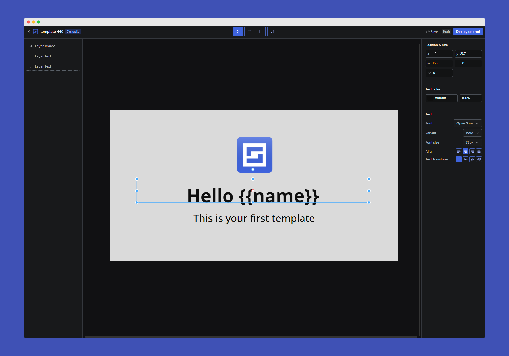

# Rendless

**Description**: Rendless is an open source Image to API editor. The main usecase is rendering dynamic OG image

- **Technology stack**: It's using Remix as fullstack framework. Radix as style. Lucia for the authentification. Satori for the image rendering. Prisma as ORM.
- **Status**: Alpha. The software is stable but is still missing style features.

**Links**:

- **Platform link**: [Link](https://rendless.com)
- **Documentation link**: [Link](https://docs.rendless.com)

**Screenshot**:

## Requirements

- Nodejs: > 18
- S3 compatible bucket
- Postgresql database

## Installation

- `npm i` : install the required packages
- `npm run build` : compile the application for production
- `npm start`: Once the application is build you can start it

## Configuration

Some environment variables are required:

- `DATABASE_URL`: URL of the postgresql database.
- `WEBSITE_URL`: URL of the website.
- `SPACES_KEY`: accessKeyId of the s3 bucket
- `SPACES_SECRET`: Secret key of the s3 bucket

Make sure to set these environment variables before running the application.

## Usage

Take a look at the [documenation](https://docs.rendless.com) for using learning how to use the rendering API.

## Known issues

- Language selection
- Text responsive when rendering
- Fonts bug when rendering with satori

## Getting help

Just open an Issue or [contact me](https://x.com/CypherGolem) on x.com

## Open source licensing info

[LICENSE](LICENSE)

---

## Credits and references

1. [Satori](https://github.com/vercel/satori)
2. [Moveable](https://github.com/daybrush/moveable)
